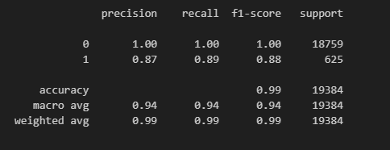
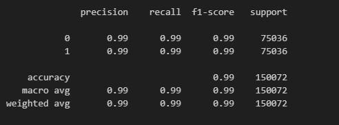

# Module 20 Report Template

## Overview of the Analysis

- Various techniques were used to train and evaluate a model based on loan risk. A dataset of historical lending activity from a peer-to-peer lending services company was used to build a model that can identify the creditworthiness of borrowers.

- The analysis that was used for the y-test was the "loan status" indicating if a loan is healthy or at risk.  The X-test used the remainder of the data (loan size, interest rate, borrower income, debt to income ratio, number of accounts and derogatory marks).

- 2 diffeent Logistic Regression models were used.  The first was with the original data set and the second was a random over resampled data set of the original data to balance out the data(0 - 75036/1 - 75036 vs. 0 - 75036/1 - 2500)

## Results

- The Logistic Regression Model with Original Data

 
The Logistic Regression model predicted well healthy loans with 100% precision and recall. It does less well at isolating high-risk loans with precision of 87% and 89% recall.
 
 
- The Logistic Regression Model with Over Sampling Data
 

 
The logistic regression model predicts the oversampled data with precision and recall of 99%.  It does well!  It did better than the original data model.

## Summary

- With the use of random oversampling of the original data, the higher the balanced accuracy and recall scores are. With higher percision and recall score, the model can predict risky loans vs. healthy loans more percisely.  The more balance the data is the more accurate the predictions are.
